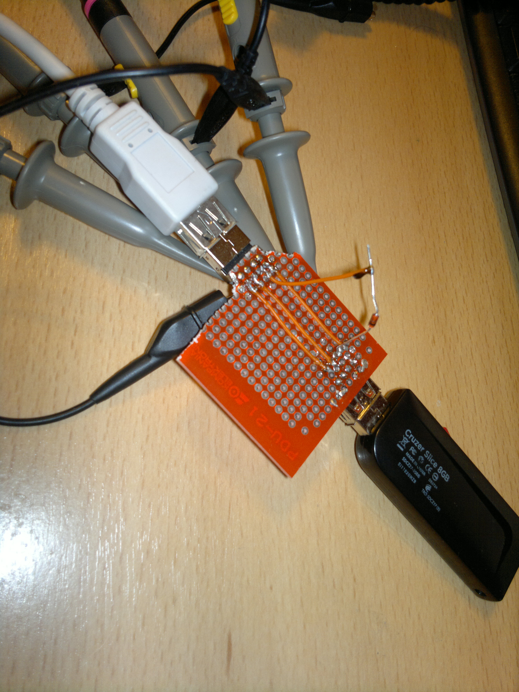

# pyCsvToUsb
Decode csv USB 1.1 signal from oscilloscope to hex

usage: 
python pyCsvUsbDecoder.py -i [input file] -o [output file] -dp [data plus column] -dm [data minus column] -m [ignore if there is less than samples]

example: 
python pyCsvUsbDecoder.py -i csv\KeyboardPressB.csv -o KeyboarPressB.txt -dp 1 -dm 2 -m 10 
python pyCsvUsbDecoder.py -i csv\PendriveConnect.csv -o PendriveConnect.txt -dp 1 -dm 2 -m 3

If packets not stats with 0x80 switch data plus and data minus columns- usb 1.5mbps and 12 mbps has swapped data wires. 
I used Rigol 1054Z csv export- it takes a bit time to dump whole 24m points. 

Usb 2.0 dowgrade? 
-Buy USB 1.1 hub- I dodn't find any 
-Connect zenner diode 2.7V to data minus(on own risk). 
Seems to work for me- at least with SanDisk Cruzer Slice 8GB.

